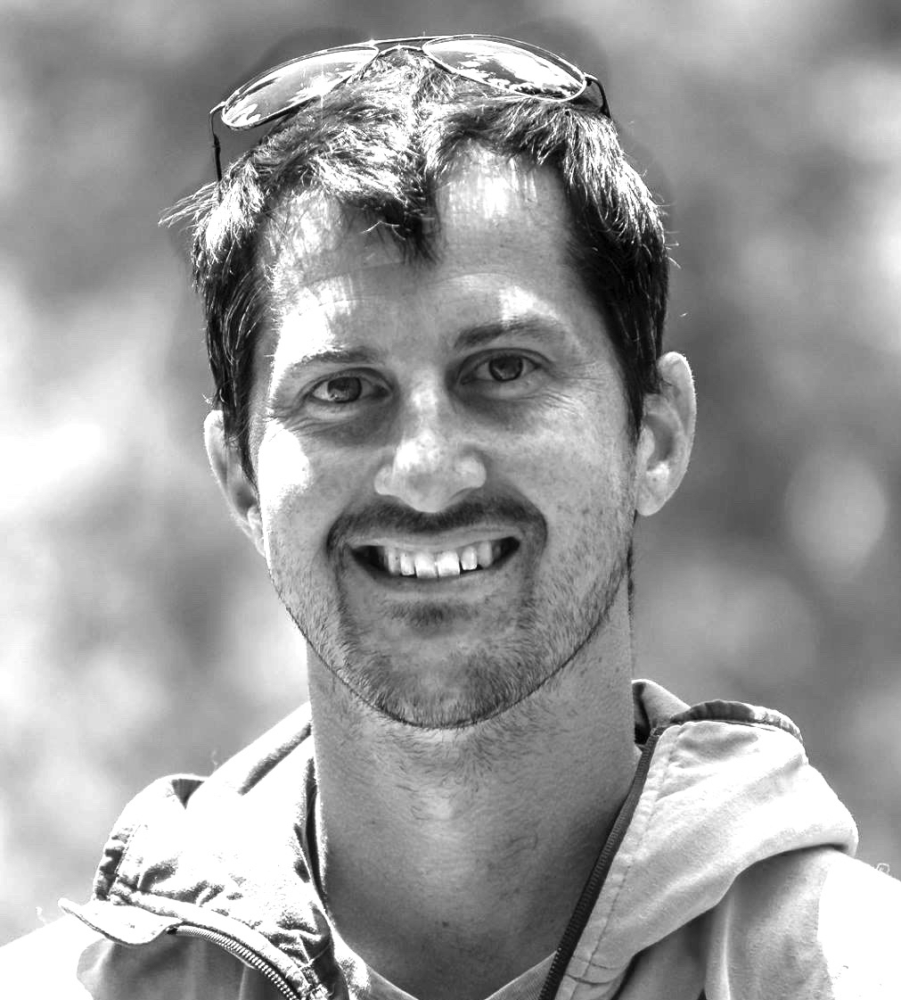

<h2>Welcome!</h2>

I am a climate scientist and glaciologist with expertise in several areas. My work falls into three primary research lines:

**Earth System Complexity.**
I lead the <a href="https://www.awi.de/en/science/geosciences/polar-terrestrial-environmental-systems/research-foci/earth-system-complexity.html" target="_blank">Earth System Complexity group</a> at AWI-Potsdam. Our work is focused on understanding long time-scale Earth system stability and large-scale feedbacks in the context of past glacial cycles and future climate change (e.g., 
<a href="https://www.nature.com/articles/nclimate1449" target="_blank">Robinson et al., Nat. Clim. Change, 2012</a>; 
<a href="https://www.nature.com/articles/ncomms16008" target="_blank">Robinson et al., Nat. Comm., 2017</a>).

**Climate extremes and risks.**
To assess future societal risk due to climate change, I am interested in the modeling and analysis of extreme and abrupt climate events (e.g., 
<a href="https://iopscience.iop.org/article/10.1088/1748-9326/8/3/034018" target="_blank">Coumou and Robinson, Env. Res. Lett., 2013</a>; 
<a href="https://www.nature.com/articles/s41586-018-0006-5" target="_blank">Caesar et al., Nat., 2018</a>; 
<a href="https://www.nature.com/articles/s41586-018-0006-5" target="_blank">Robinson et al., npj Atmos.Nat., 2021</a>).

**Energy-system resilience.**
Here I work to support the resilient design of hybrid renewable energy generation systems for changing climatic conditions (e.g., 
<a href="https://www.sciencedirect.com/science/article/abs/pii/S0960148116304414?via%3Dihub" target="_blank">Petrakopoulou et al., Re. Ener., 2016</a>; 
<a href="https://www.sciencedirect.com/science/article/abs/pii/S0959652620328614?via%3Dihub" target="_blank">Petrakopoulou et al., J. Clean. Prod., 2020</a>).

Check out my [publications](publications/) and [news](news/) for more information about my work.

<b>I am always interested in starting new collaborations. Please contact me!</b> 

 
**Contact** 
Alfred Wegener Institute, Helmholtz Centre for Polar and Marine Research    
Telegrafenberg A45  
14473 Potsdam, Germany  

